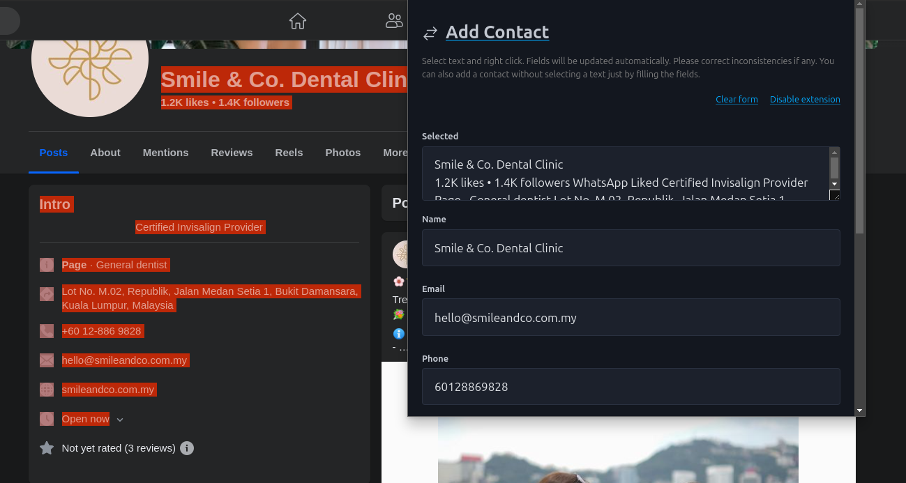
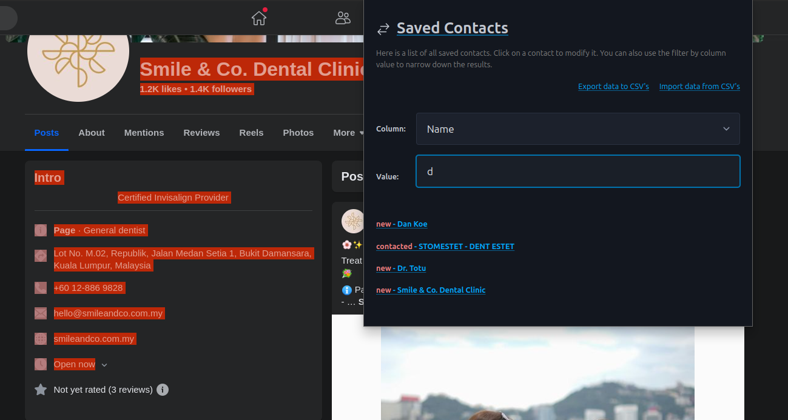

# Sales Assistant

If you are collecting contact information from the web for the purpuse of B2B colaboration or you are a HR profesional looking for candidates - this tool can be helpful.
It helps you save faster a new contact and keep track in one place of all contacts saved.


## How to install it

This tool runs on your laptop/pc, it's a browser extension + binary server.

- Go to `edge://extensions/` if you are using Microsoft Edge Browser or `chrome://extensions/` for Google Chrome browser;
- Look for `Developer mode` toggle and activate it;
- Click on `Load unpacked` button and point to `extension` folder;
- On windows open binary `server.exe` by double clicking it;
- On Linux/Mac open a terminal where the `server` executable is, type `./server` and press Enter;
- With the server running you can start navigating the web in search of possible clients or candidates;
- 
- **Note: Binary server has was created without paying a license to run to Microsoft/Apple so it will show some warnings. You can build binary on your own machine if you want to avoid that**;


## How to use it

In short select text with contact information, right click, open extension, modify/save contact (`Add contact` page). 
You can view/export/import contacts on the on the `Saved Contacts`. 


**Add contact**
- Select text that contains contact information, right click and open extension;
- You will see that some data is already filled in the fields - modify/update it and then save it;
- At the top of the extension you can see the `Add contact` header - if you click on it, you will see the saved contacts;
- The `Clear form` link when clicked it will of course clear all the fields in the form;
- The `Disable extension` link when clicked it will stop sending requests to the server (otherwise you will see an alert each time you are visiting a website and the server is not running);
- Fields `Email` and `Phone` will be automatically filled (if possible); 
- You can modify before saving any field;
- In the `Name` field as you type it will show you suggestions of already saved contacts. Once you click on a suggestion it will automatically fill all the fields so you can update them;
- As you type in the `Status` field you will get suggestions of all the statuses already saved (this way you can keep a consistent pipeline);
- If you are on a webpage on which you already saved contact information the form will be already filled;


 

**Saved Contacts**
- On the `Saved Contacts` page you can view/export/import saved contacts; 
- If you click on `Export data to CSV's` next to the server an `exports` folder will be created which will contain CSV files with all the contacts from the sqlite3 `database.db`. If you have more than 800k contacts saved, the CSV's will be splitted for ease of use in other tools like Microsoft Excel or Google sheets. You can also use DB Browser for Sqlite3 to interact with the database and perform bulk operations.
- If you click on `Import data from CSV's` all the CSVs from `exports` will be imported on the database. **NOTE:** Id column is very important don't modify it (you can delete row(s) safely). 
- You can filter by column value the saved contacts. Select column and start typing - the relevant contacts names will show up;
- If you click on a contact link, the webpage from which you saved that contact will be opened;
- If you are on a webpage on which you already collected contact information before the `Add contact` form will be already filled so you can just modify data if needed (ex: add another status);




## Tech stuff

The browser extension is built with [React(Typescript)](https://react.dev/) with [crxjs vite plugin](https://github.com/crxjs/chrome-extension-tools) and the server is built in [Fiber(Go)](https://gofiber.io/). Data is saved in a [sqlite3 database](https://www.sqlite.org/index.html). 


Here are some commands you can use to build from source the server binary.

Windows 64bit:
```bash
GOOS=windows GOARCH=amd64 go build -o dist/server.exe main.go
```

Linux 64bit:
```bash
GOOS=linux GOARCH=amd64 go build -o dist/server main.go
```

Mac 64bit:
```bash
GOOS=darwin GOARCH=amd64 go build -o dist/server main.go
```

Of course, modify these commands as needed for your specific hardware architecture.


